# HW2

> author: 111062272 蕭登鴻

## 1

### a

| **Subroutine**   | **Starting memory address** | **Ending memory address** | **Reference** |
|------------------|-----------------------------|---------------------------|---------------|
| fast_power_recur | 0xb0                        | 0xe8                      | jal ra, 0xb0  |
| fast_power_iter  | 0xb0                        | 0xcc                      | jal ra, 0xb0  |

Recursive:

<p float="left">
  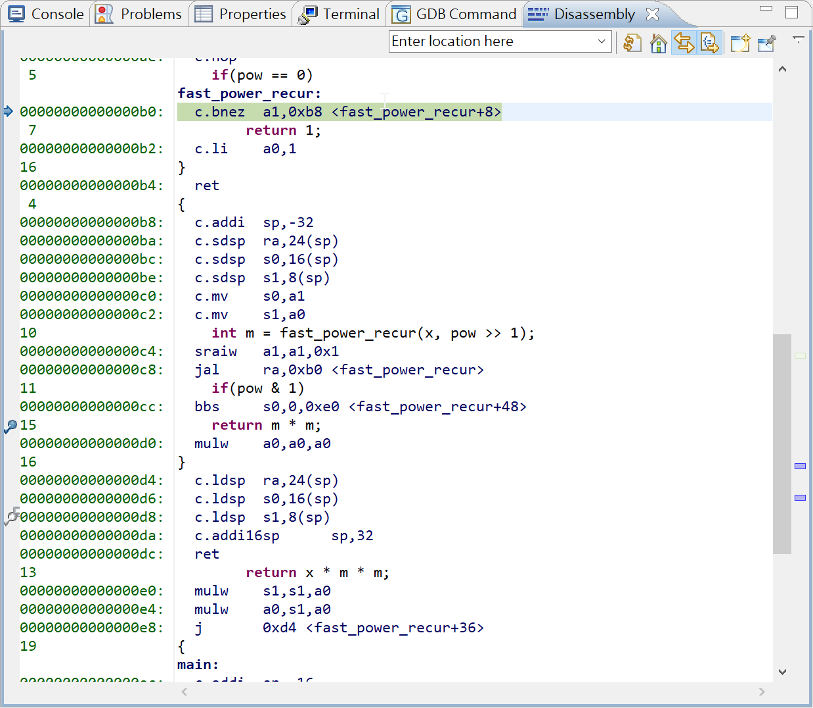
  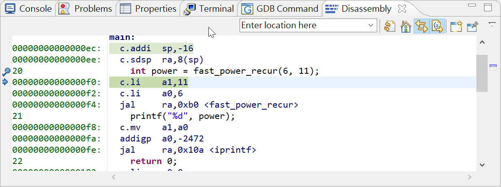
</p>

Iterative:

<p float="left">
  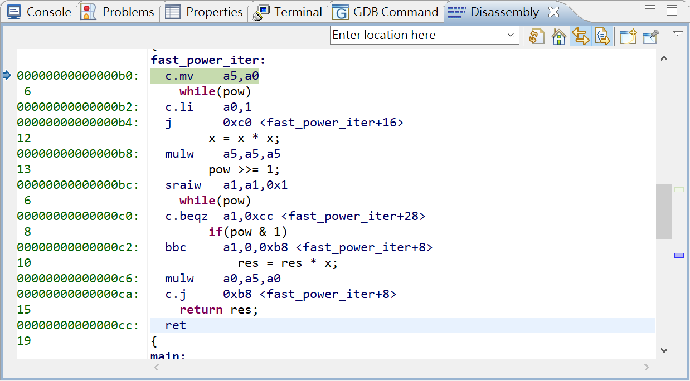
  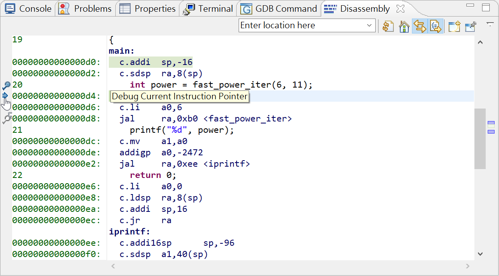
</p>

### b

| Code memory address | Instruction       | Saved register | Stack offset |
|---------------------|-------------------|----------------|--------------|
| 0xba                | c.sdsp ra, 24(sp) | ra             | 24           |
| 0xbc                | c.sdsp s0, 16(sp) | s0             | 16           |
| 0xbe                | c.sdsp s1, 8(sp)  | s1             | 8            |

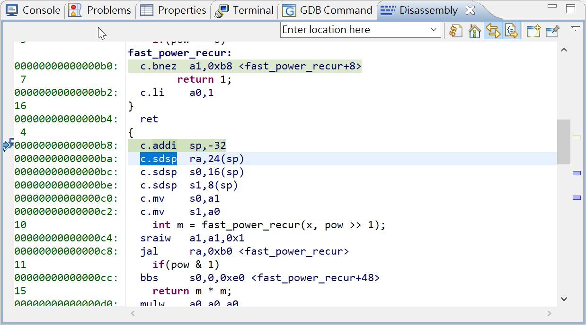

### c

| Function         | x.reg | x.val | pow.reg | pow.val | return.reg | return.val |
|------------------|-------|-------|---------|---------|------------|------------|
| fast_power_iter  | a0    | 6     | a1      | 11      | a0         | 362797056  |
| fast_power_recur | a0    | 6     | a1      | 11      | a0         | 362797056  |

Iterative:

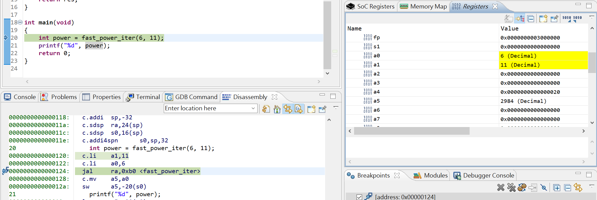
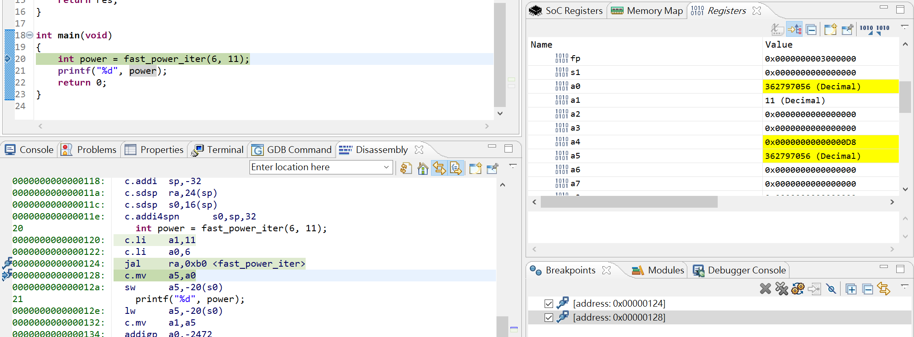

Recursive:

<p float="left">
  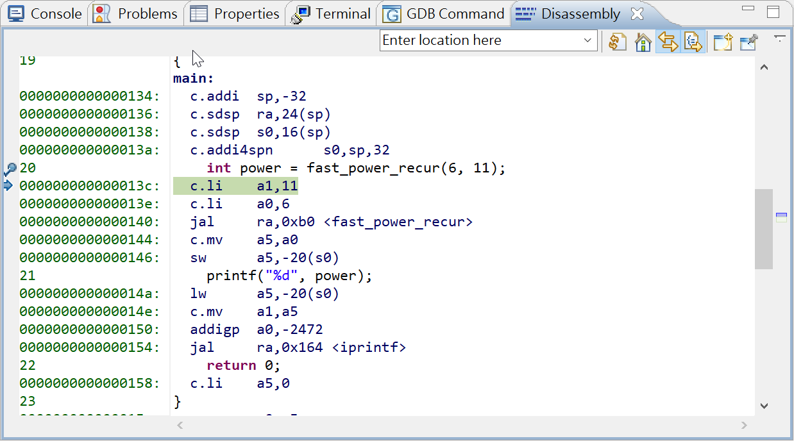
  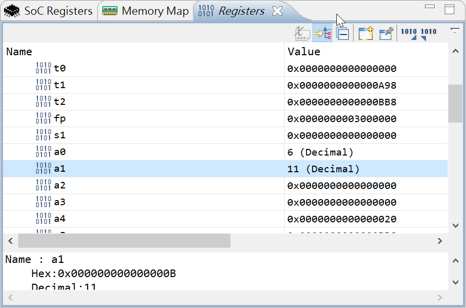
  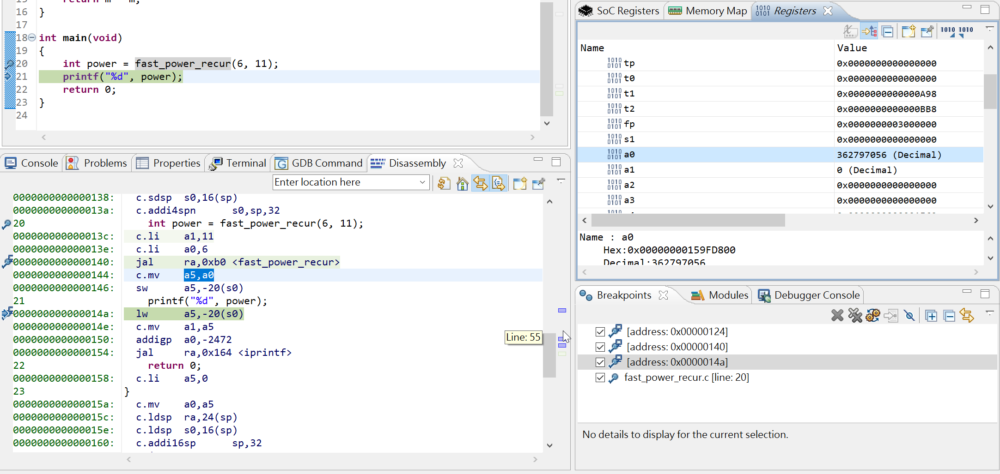
</p>


### d

CycC of each core is as below:

| Core/Time | t0  | t1      | t2      | t3    | t4      |
| --------- | --- | ------- | ------- | ----- | ------- |
| A         | 1   | 1       | 1       | 1     | 0       |
| B         | 1   | 1       | 1       | 1     | 0       |
| C         | 0   | 1+1+5=7 | 1+1+2=4 | 1+4=5 | 1+1+2=4 |

Sequential mode: 2 + 9 + 6 + 7 + 4 = 28

Pipelining + parallel mode: 1 + 7 + 4 + 5 + 4 = 21

<p>
$$
\text{Speedup } = \frac{T}{T'} = \frac{28}{21} = \frac{4}{3} \lt 2
$$
</p>

Core A, B, C (in order):

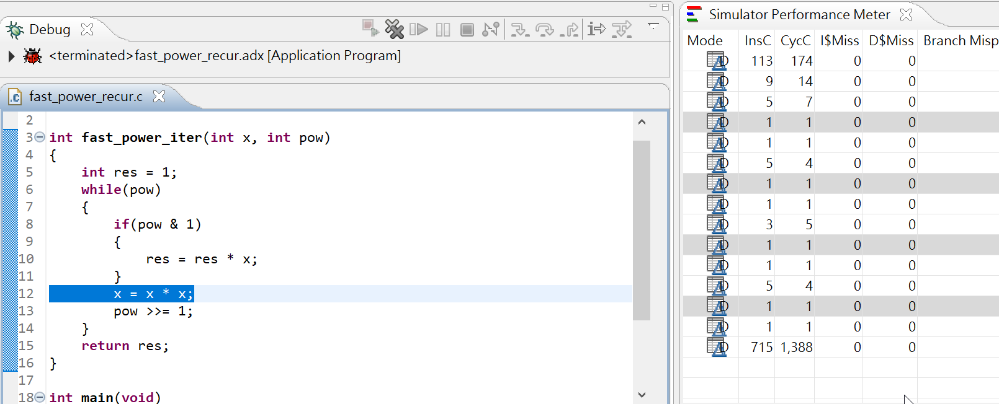
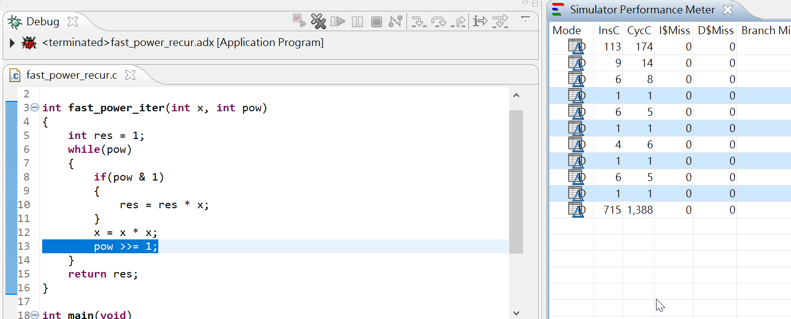
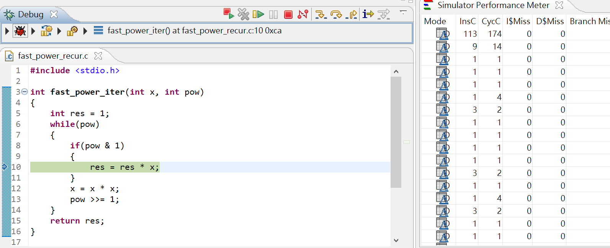


## 2
### a

| Instruction ID | Hexadecimal Encoded instruction | Decoded Instruction |
|----------------|---------------------------------|---------------------|
| 5 | 0x0040 8067 | jalr x0, 4(x1) |
| 6 | 0xFF84 3283 | ld x5, -8(x8) |
| 8 | 0x4142 D293 | srai x5, x5, 20 |

ID 5: jump directly to memory x1 + 4, don't save return address

ID 6: load M[x8 - 8] to reg x5

ID 8: shift reg x5 right for (20/4) = 5 hex units

### b
| Instruction ID | Updated register | Updated memory |
|----------------|------------------|----------------|
| 1 | x7 = x5 - x6 = 0x0004 | - |
| 2 | - | M[0x0000 003E FF20 13F0] = 0xFF20 13E0<br>M[0x0000 003E FF20 13F4] = 0x0000 003E |
| 3 | x1 = PC + 4 = 0x0000 0000 0001 00BC | - |
| 6 | x5 = M[0x0000 003E FF20 13F8] = 0x0A0B 0130 0041 0000 | - |
| 7 | x5 = x30 & x5 = 0x0040 0000 | - |
| 8 | x5 >>= 4 = 0x0004 | - |
| 9 | - | - |
| 10 | x28 = x2 = 0x0000 003E FF20 13E0 | - |
| 11 | x7 <-(byte) M[0x0000 003E FF20 13EA] = 0xFFFF FFFF FFFF FF91 | - |
| 12 | - | - |
| 13 | x1 = PC + 4 = 0x0000 0000 0001 00E4 | - |
| 4 | x6 <-(word) M[0x0000 003E FF20 13E4] = 0xFFFF FFFF A800 3F10 | - |
| 5 | - | - |
| 15 | x7 = x6 ^ x7 = 0x57FF C081 | - |
| 16 | x7 >>= 4 = 0x57FF | - |
| 17 | x31 = x6 + 1000 = 0xFFFF FFFF A800 42F8 | - |
| 18 | x31 >>= 4 = 0xFFFF FFFF FFFF A800 | - |
| 19 | - | M[0x0000 003E FF20 13F8] = 0x0041 0004 |
| 20 | - | M[0x0000 003E FF20 13E8] = 0xFFFF A800<br> M[0x0000 003E FF20 13EC] = 0xFFFF FFFF |

### c

Since instruction fetch is needed for executing every instruction, the number of memory access is 19 (equal to the number of instruction executed).

### d

offset = -15 * 4 = -60

using half word address => -30

-30 = 1...10 0010

| imm[12  , 10:5] |  rs2  |  rs1  | funct3 | imm[4:1  , 11] | opcode  |
| :-------------: | :---: | :---: | :----: | :------------: | :-----: |
|     1 11110     | 00111 | 11111 |  100   |     0010 1     | 1100011 |

since x31 = 0xFFFF FFFF FFFF A800, x7 = 0x57FF

=> x31 < x7 => branch

Ans:

|     Code address      | Assembly instruction | Hexadecimal encoded instruction | Taken? |
| :-------------------: | :------------------: | :-----------------------------: | :----: |
| 0x0000 0000 0001 0100 |   blt x31, x7, -60   |           0xFC7FC2E3            |  Yes   |

## 3

|             | x28 | x29 | x30  | x31  |
| :---------: | :-: | :-: | :--: | :--: |
| Var. naming |  a  |  b  | imm. | imm. |

```cpp
// bits counter for MemArray[0] ~ MemArray[m - 1]

for (int i = 0, *a = &MemArray[0]; i < m; i++, a++) {
	int total = 0, b = *a;

	// count 1s in b's binary format
	for (int j = 0; j < 32; j++) {
		total += (b >> j) % 2;
	}
	*a = total;
}
```

## 4

```cpp
j = *(&B + *(&A + 4i + 1)) + *(&B + i)
```

### a

```text
num1:
	slli t0, x7, 2
	addi t0, t0, 1
	slli t0, t0, 2
	add t0, t0, x5
	lw t0, 0(t0)
	slli t0, t0, 2
	add t0, t0, x6
	lw t0, 0(t0)
num2:
	slli t1, x7, 2
	add t1, t1, x6
	lw t1, 0(t1)
sum:
	add x11, t0, t1
```

### b

```text
num1:
	slli t0, x7, 2
	addi t0, t0, 1
	slli t0, t0, 3
	add t0, t0, x5
	ld t0, 0(t0)
	slli t0, t0, 3
	add t0, t0, x6
	ld t0, 0(t0)
num2:
	slli t1, x7, 3
	add t1, t1, x6
	ld t1, 0(t1)
sum:
	add x11, t0, t1
```

## 5

ABI is used; a0 is used to store arg & return value of Func

```text
Func:
	addi sp, sp, -16 # save caller's args & return address
	sd ra, 0(sp)
	sd a0, 8(sp)

	bne a0, zero, NOT_ZERO
	addi a0, zero, 0 # set return to 0
	addi sp, sp, 16 # restore stack for caller
	jalr x0, 0(ra) # return

NOT_ZERO:
	andi t0, a0, 1 # check n's parity, save result in t0
	bne t0, zero, IS_ODD

	srai a0, a0, 1 # ready to call Func(n >> 1)
	jal ra, Func
	mv t1, a0 # save return value in t1

	ld ra, 0(sp) # restore stack
	ld a0, 8(sp)
	addi sp, sp, 16

	add a0, a0, t1 # set return value to n + t1
	jalr zero, 0(ra) # return

IS_ODD:
	srai a0, a0, 1 # ready to call Func(n >> 1)
	jal ra, Func
	mv t1, a0 # save return value in t1

	ld ra, 0(sp) # restore stack
	ld a0, 8(sp)
	addi sp, sp, 16

	add a0, t1, 0 # set return value to t1
	jalr zero, 0(ra) # return
```