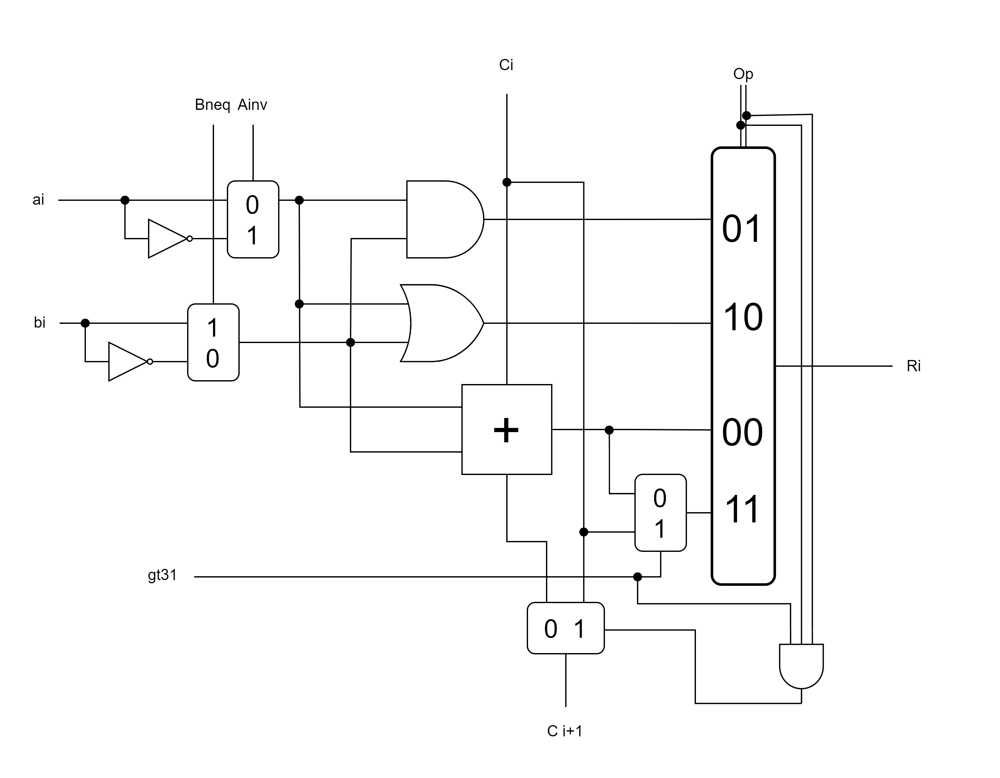
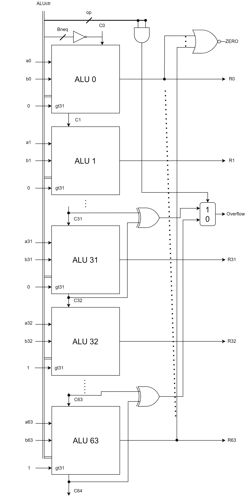

# HW3

> author: 111062272 蕭登鴻

## 1

| Ainvert | Bnegate | Operation | Function |
| ------- | ------- | --------- | -------- |
| 0       | 1       | 01        | AND      |
| 0       | 1       | 10        | OR       |
| 0       | 1       | 00        | add      |
| 0       | 0       | 00        | sub      |
| 1       | 0       | 01        | NOR      |
| 0       | 1       | 11        | add-ext  |
| 0       | 0       | 11        | sub-ext  |

In the 1-bit ALU, I use $C_i$ to propagate the sign bit when sign extension is needed (when op = 11 and gt31 = 1); with signal `gt31` indicates that whether the ALU sequence number is greater than 31.

For the 64-bit ALU, the dotted line indicates that each $R_i$ is connected to the multi-OR gate for the `ZERO` output; and `op` is used to determine which version (32 or 64) of overflow is outputted as the `Overflow` output.

<p float="left">
  <h3>1-bit ALU:</h3>
  
  <br>
  <h3>64-bit ALU:</h3>
  
</p>

## 2

### a

| multiplier | mul.cand  | prod.     |
| ---------- | --------- | --------- |
| 1001       | 0000 1110 | 0000 0000 |
| 0100       | 0001 1100 | 0000 1110 |
| 0010       | 0011 1000 | ..        |
| 0001       | 0111 0000 | ..        |
| 0000       | 1110 0000 | 0111 1110 |

### b

| mul.cand | <u>prod</u>, multiplier |
| -------- | ----------------------- |
| 1110     | <u>0000</u> 1001        |
|          | <u>1110</u> 1001        |
| 1110     | <u>0111 0</u>100        |
|          | ..                      |
| 1110     | <u>0011 10</u>10        |
|          | ..                      |
| 1110     | <u>0001 110</u>1        |
|          | <u>1111 110</u>1        |
| 1110     | <u>0111 1110</u>        |

## 3

### a

| quotient | divisor   | remainder |
| -------- | --------- | --------- |
| 0000     | 0101 0000 | 0000 0111 |
|          |           | 1011 0111 |
| 0000     | 0010 1000 | 0000 0111 |
|          |           | 1001 1111 |
| 0000     | 0001 0100 | 0000 0111 |
|          |           | 1111 0011 |
| 0000     | 0000 1010 | 0000 0111 |
|          |           | 1111 1101 |
| 0000     | 0000 0101 | 0000 0111 |
|          |           | 0000 0010 |
| 0001     | 0000 0101 | 0000 0010 |

### b

| <u>remainder</u>, <u>quo</u> | divisor | test pass |
| ---------------------------- | ------- | --------- |
| <u>0000 0111</u>             | 0101    |           |
| <u>0000 111</u>0             |         |           |
| 1011 1110                    |         | F         |
| <u>0001 11</u>0<u>0</u>      |         |           |
| 1100 1100                    |         | F         |
| <u>0011 1</u>0<u>00</u>      |         |           |
| 1110 1</u>000                |         | F         |
| <u>0111</u> 0<u>000</u>      |         |           |
| 0010 0000                    |         | T         |
| <u>0100</u> <u>0001</u>      |         |           |
| <u>0010</u> <u>0001</u>      |         |           |

## 4

### a

0x05948DEC = 101100101001000110111101100$_2$

<p>
signed: $2^{26} + 2^{24} + 2^{23} + 2^{20} + 2^{18} + 2^{15} + 2^{11} + 2^{10} + 2^{8} + 2^{7} + 2^{6} + 2^{5} + 2^{3} + 2^{2}$

un-signed: same as signed
</p>

| hex      | un-signed                | signed                   |
| -------- | ------------------------ | ------------------------ |
| 05948DEC | <p>93,621,740$_{10}$</p> | <p>93,621,740$_{10}$</p> |

Since left-most bit = 0 (5 = 0101), they're the same.

### b

NOT(0xFA6B7214) + 1 = NOT(11111010011010110111001000010100$_2$) + 1 = 00000101100101001000110111101100$_2$

<p>

signed: $-(2^{26} + 2^{24} + 2^{23} + 2^{20} + 2^{18} + 2^{15} + 2^{11} + 2^{10} + 2^{8} + 2^{7} + 2^{6} + 2^{5} + 2^{3} + 2^{2})$

un-signed: $2^{31} + 2^{30} + 2^{29} + 2^{28} + 2^{27} + 2^{25} + 2^{22} + 2^{21} + 2^{19} + 2^{17} + 2^{16} + 2^{14} + 2^{13} + 2^{12} + 2^{9} + 2^{4} + 2^{2}$
</p>

| hex      | un-signed                   | signed                    |
| -------- | --------------------------- | ------------------------- |
| FA6B7214 | <p>4,201,345,556$_{10}$</p> | <p>-93,621,740$_{10}$</p> |

Since left-most bit = 1 (F = 1111), they're not the same.

### c

<p>
0x05948DEC = 0, 0000 1011, 0010 1001 0001 1011 1101 100$_2$ = $+1.00101001000110111101100\cdot 2^{11 - 127}$ = $1.3969987\cdot 10^{-35}$

0xFA6B7214 = 1, 1111 0100, 1101 0110 1110 0100 0010 100$_2$ = $-1.11010110111001000010100\cdot 2^{244 - 127}$ = $-3.0562589\cdot 10^{35}$
</p>

| hex      | IEEE 754 floating point (decimal) |
| -------- | --------------------------------- |
| 05948DEC | 1.3969987E-35                     |
| FA6B7214 | -3.0562589E35                     |

## 5

bias = 127

### a

#### 88.4375

<p>
$88.4375_{10}$ = $1011000.0111_2$ = $1.0110000111 \cdot 2^{6}$; 6+127 = $1000 0101_{2}$
</p>

=> = 0, 1000 0101, 0110 0001 1100 0000 000

#### -7.3125

<p>
$-7.3125_{10}$ = $-111.0101_2$ = $-1.110101 \cdot 2^{2}$; 2+127 = $1000 0001_{2}$
</p>

=> = 1, 1000 0001, 1101 0100 0000 0000 000

### b

Step1: multiply significand

<p>
1.0110000111 * 1.110101 = 10.1000 0110 1011 0011 $\overset{\text{normalize}}{=} 1.0100 0011 0101 1001 1000\cdot 2^1$
</p>

Step2: calc exp: 127 + (6 + 2) + 1 = $1000 1000_2$

Step3: calc sign: 1 * -1 = -1

=> = 1, 1000 1000, 0100 0011 0101 1001 1000 000

## 6

### a

ans: 0, 0 0000 0001, 0000 00 = $1.0 \cdot 2^{-254} = a_0$

### b

1st biggest: 0, 0 0000 0000, 1111 11 = $0.111111\cdot 2^{-254} = a_1$

2nd biggest: 0, 0 0000 0000, 1111 10 = $0.111110\cdot 2^{-254} = a_2$

### c

$|a_0 - a_1| = 0.0000 01\cdot 2^{-254}$

$|a_1 - a_2| = 0.0000 01\cdot 2^{-254}$

### d

1, 0 1111 0110, 1001 11 => $1.100111\cdot 2^{246-255} = -1.100111\cdot 2^{-9}$ = $-0.000000001100111_2$

### e

$1.31_{10} = 1.0100111101011100011\cdots_2$

=> $0, 0 1111 1111, 0101 00 = 1.010100\cdot 2^{255-255} = \underset{\text{U}}{\underline{1.010100_2}} = 1.3125_{10}$

## 7

`(X + a) >> 2` $\equiv \left\lfloor\frac{X + a}{4}\right\rfloor$

### a

```cpp
(X + 3) >> 2
```

testing X = 2:

=> $\left\lfloor\frac{2 + 3}{4}\right\rfloor = 1 \neq 0 = (2 / 4)$ => false

Ans: not equivalent

### b

```cpp
((X >= 0) ? X >> 2 : (X + 3) >> 2)
```

Obviously true for $X \geq 0,$

for $X \lt 0,\ f(X) = \left\lfloor\frac{X + 3}{4}\right\rfloor$

testing a full period (-1 ~ -5):

$f(-1) = 0, f(-2) = 0, f(-3) = 0, f(-4) = -1, f(-5) = -1, ...$ => true

Ans: equivalent

### c

```cpp
X >> 2
```

Obviously true for $X \geq 0,$

for $X \lt 0,\ f(X) = \left\lfloor\frac{X}{4}\right\rfloor$

testing X = -1:

$f(-1) = -1 \neq 0$ => false

Ans: not equivalent

### d

```cpp
(X + ((X >> 31) & 3 )) >> 2
```

if $X \geq 0,$
> (X >> 31) & 3
> = (0..0) & (10)
> = 0

if $X \lt 0,$
> (X >> 31) & 3
> = (1..1) & (10)
> = 3

by conclusion from (a), (b), (c),

if $X \geq 0$: `X >> 2` => true

if $X \lt 0$: `(X + 3) >> 2` => true

Ans: equivalent
