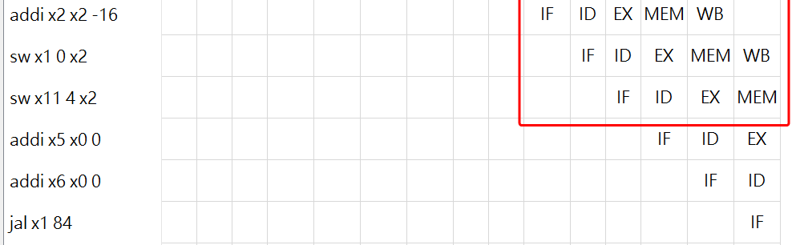

# HW5

> author: 111062272 蕭登鴻

## 1

Flowchart of the main program:


testcase1:


testcase2:


## 2

### Type 1 & 2

The code segment (line 58~60)

```assembly
addi sp, sp, -16
sw ra, 0(sp)
sw a1, 4(sp)
```

contains both type 1 & 2 dependency (sp).

Ripes solve them by forwarding in the `MEM` & `WB` stage, as illustrated:


Pipeline result:



### Type 3

The code segment (line 67, 68)

```assembly
lw a0, 4(sp)
bge t1, a0, loop_end
```

contains a type 3 dependency (a0).

Ripes solve it by first inserting a nop(stall), so as to execute a `WB` forwarding in the next cycle.


Pipeline result:


### Type 4

After thorough search, example of type 4 dependency can't be identified in my assembly code. However, we can use the same code segment in type 3 with little modification for illustration:

Consider the code segment (67, 68, 71, with comments omitted), and replace line 68 with code irrelevant to register `a0`:

```assembly
lw a0, 4(sp)
... # some code irrelevant to a0
sub a1, a0, t1
```

This is a type 4 dependency (a0).

The way of solving it is similar in type 3, with no `nop` inserted. A `WB` forwarding can be executed directly.

### Type 5

The code segment (line 76, 79, with comments omitted)

```assembly
jal ra, loadSS
mv t4, t1
```

contains a type 5 dependency.

Ripes solve it by activating the `clear` signal of the `IF/ID` & `ID/EX` register file, which resulted in two `nop` (s).


Pipeline result:


