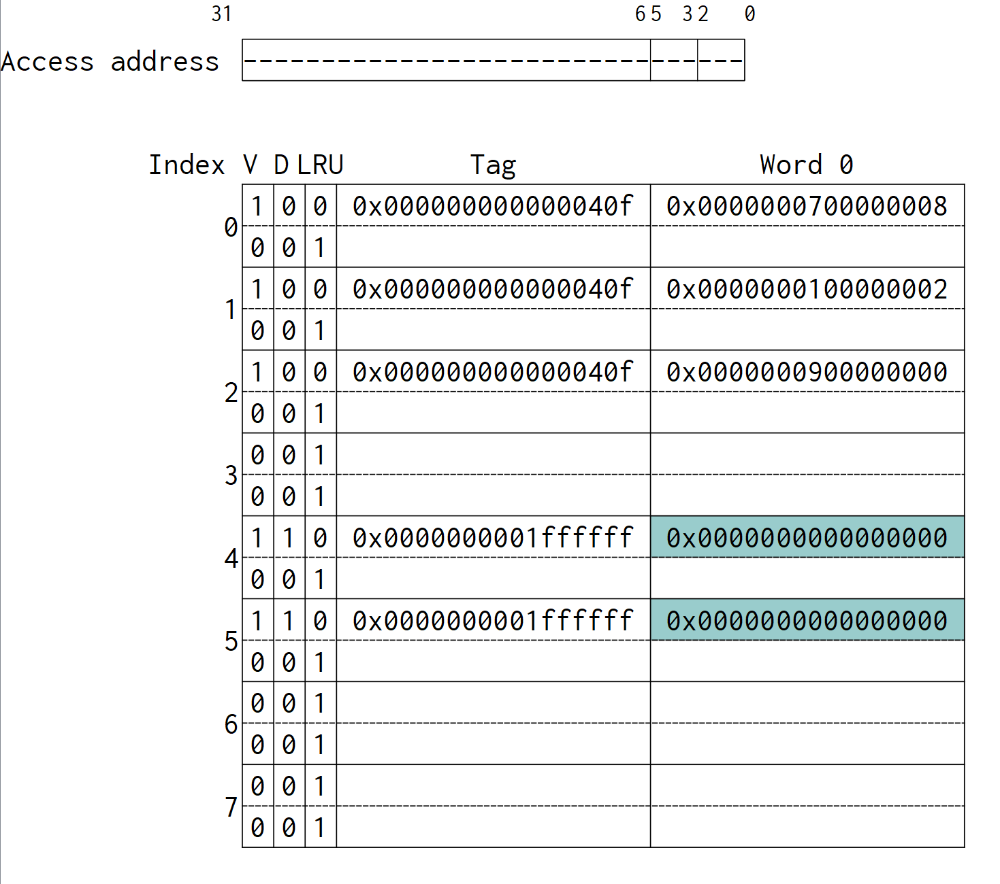

# HW6

> author: 111062272 蕭登鴻

## 1

Notice: Since cache access happens at stage `MEM`, instruction executed in picture `after` is at stage `MEM`.

### case a

<p float="left">
  <h5>before:</h5>
  
  <br>
  <h5>after:</h5>
  
  <br>
  <h5>instructions:</h5>
  
</p>

Explanation: Set 0 has 1 already-occupied block when a write-allocate (write miss) happens. Therefore, dirty bit is set to 1, and the ref. bit of two ways is swapped.

### case b

<p float="left">
  <h5>before:</h5>
  
  <br>
  <h5>after:</h5>
  
  <br>
  <h5>instructions:</h5>
  
</p>

Explanation: Way 1 of set 0 becomes dirty when a write hit happens. Therefore, dirty bit is changed from 0 to 1, and the ref. bit of two ways is swapped.

### case c

<p float="left">
  <h5>before:</h5>
  
  <br>
  <h5>after:</h5>
  
  <br>
  <h5>instructions:</h5>
  
</p>

Explanation: A write miss happens at way 0 of set 5, which is marked dirty. Therefore, a write back is performed according to the WB counter on the left; dirty bit is changed from 0 to 1; the ref. bit of two ways is swapped.

### d

<p float="left">
  <h5>original:</h5>
  
  <br>
  <h5>own-design:</h5>
  
</p>

Explanation: Owning to the frequent-array-accessing nature in quicksort algorithm, increasing the parameter `Words/Line` accords to the increasing ability of handling spacial locality; therefore increase the hit rate from 84.94% to 98.14%.

## 2

### a

| encoding  | p1  | p2  | d1  | p4  | d2  | d3  | d4  | p8  | d5  | d6  | d7  | d8  | d9  | d10 |
| --------- | --- | --- | --- | --- | --- | --- | --- | --- | --- | --- | --- | --- | --- | --- |
| bit pos   | 1   | 2   | 3   | 4   | 5   | 6   | 7   | 8   | 9   | 10  | 11  | 12  | 13  | 14  |
| bit value |     |     | 1   |     | 0   | 0   | 1   |     | 0   | 1   | 1   | 0   | 0   | 1   |
| p1        | x   |     | x   |     | x   |     | x   |     | x   |     | x   |     | x   |     |
| p2        |     | x   | x   |     |     | x   | x   |     |     | x   | x   |     |     | x   |
| p4        |     |     |     | x   | x   | x   | x   |     |     |     |     | x   | x   | x   |
| p8        |     |     |     |     |     |     |     | x   | x   | x   | x   | x   | x   | x   |

(under xor addition)

p1 = 1 + 0 + 1 + 0 + 1 + 0 = 1

p2 = 1 + 0 + 1 + 1 + 1 + 1 = 1

p4 = 0 + 0 + 1 + 0 + 0 + 1 = 0

p8 = 0 + 1 + 1 + 0 + 0 + 1 = 1

C\\{p11\} = 11 1 0 001 1 011001

p11 = sum(11 1 0 001 1 011001) = 0

=> C = 11 1 0 001 1 011001 0

### b

```
No errors
```

| decoding  | p1  | p2  | d1  | p4  | d2  | d3  | d4  | p8  | d5  | d6  | d7  | d8  | d9  | d10 | p11 |
| --------- | --- | --- | --- | --- | --- | --- | --- | --- | --- | --- | --- | --- | --- | --- | --- |
| bit pos   | 1   | 2   | 3   | 4   | 5   | 6   | 7   | 8   | 9   | 10  | 11  | 12  | 13  | 14  | 15  |
| bit value | 1   | 1   | 1   | 0   | 0   | 0   | 1   | 1   | 0   | 1   | 1   | 0   | 0   | 1   | 0   |
| p1        | x   |     | x   |     | x   |     | x   |     | x   |     | x   |     | x   |     |     |
| p2        |     | x   | x   |     |     | x   | x   |     |     | x   | x   |     |     | x   |     |
| p4        |     |     |     | x   | x   | x   | x   |     |     |     |     | x   | x   | x   |     |
| p8        |     |     |     |     |     |     |     | x   | x   | x   | x   | x   | x   | x   |     |

h1 = 1 + 1 + 0 + 1 + 0 + 1 + 0 = 0

h2 = 1 + 1 + 0 + 1 + 1 + 1 + 1 = 0

h4 = 0 + 0 + 0 + 1 + 0 + 0 + 1 = 0

h8 = 1 + 0 + 1 + 1 + 0 + 0 + 1 = 0

hn = 0

=> No errors

### c

```
Suppose d5 of C is inverted
```

| decoding  | p1  | p2  | d1  | p4  | d2  | d3  | d4  | p8  | d5  | d6  | d7  | d8  | d9  | d10 | p11 |
| --------- | --- | --- | --- | --- | --- | --- | --- | --- | --- | --- | --- | --- | --- | --- | --- |
| bit pos   | 1   | 2   | 3   | 4   | 5   | 6   | 7   | 8   | 9   | 10  | 11  | 12  | 13  | 14  | 15  |
| bit value | 1   | 1   | 1   | 0   | 0   | 0   | 1   | 1   | 1   | 1   | 1   | 0   | 0   | 1   | 0   |
| p1        | x   |     | x   |     | x   |     | x   |     | x   |     | x   |     | x   |     |     |
| p2        |     | x   | x   |     |     | x   | x   |     |     | x   | x   |     |     | x   |     |
| p4        |     |     |     | x   | x   | x   | x   |     |     |     |     | x   | x   | x   |     |
| p8        |     |     |     |     |     |     |     | x   | x   | x   | x   | x   | x   | x   |     |

h1 = 1 + 1 + 0 + 1 + 0 + 1 + 0 = 1

h2 = 1 + 1 + 0 + 1 + 1 + 1 + 1 = 0

h4 = 0 + 0 + 0 + 1 + 0 + 0 + 1 = 0

h8 = 1 + 0 + 1 + 1 + 0 + 0 + 1 = 1

hn = 1

<p>
=> Single error in pos $1001_2$ = 9: d5
</p>

### d

```
Suppose p1 and d8 of C are inverted
```

| decoding  | p1  | p2  | d1  | p4  | d2  | d3  | d4  | p8  | d5  | d6  | d7  | d8  | d9  | d10 | p11 |
| --------- | --- | --- | --- | --- | --- | --- | --- | --- | --- | --- | --- | --- | --- | --- | --- |
| bit pos   | 1   | 2   | 3   | 4   | 5   | 6   | 7   | 8   | 9   | 10  | 11  | 12  | 13  | 14  | 15  |
| bit value | 0   | 1   | 1   | 0   | 0   | 0   | 1   | 1   | 0   | 1   | 1   | 1   | 0   | 1   | 0   |
| p1        | x   |     | x   |     | x   |     | x   |     | x   |     | x   |     | x   |     |     |
| p2        |     | x   | x   |     |     | x   | x   |     |     | x   | x   |     |     | x   |     |
| p4        |     |     |     | x   | x   | x   | x   |     |     |     |     | x   | x   | x   |     |
| p8        |     |     |     |     |     |     |     | x   | x   | x   | x   | x   | x   | x   |     |

h1 = 1 + 1 + 0 + 1 + 0 + 1 + 0 = 1

h2 = 1 + 1 + 0 + 1 + 1 + 1 + 1 = 0

h4 = 0 + 0 + 0 + 1 + 0 + 0 + 1 = 1

h8 = 1 + 0 + 1 + 1 + 0 + 0 + 1 = 1

hn = 0

=> Double error detected

### e

| decoding  | p1  | p2  | d1  | p4  | d2  | d3  | d4  | p8  | d5  | d6  | d7  | d8  | d9  | d10 | p11 |
| --------- | --- | --- | --- | --- | --- | --- | --- | --- | --- | --- | --- | --- | --- | --- | --- |
| bit pos   | 1   | 2   | 3   | 4   | 5   | 6   | 7   | 8   | 9   | 10  | 11  | 12  | 13  | 14  | 15  |
| bit value | 0   | 1   | 1   | 0   | 0   | 0   | 1   | 1   | 0   | 1   | 1   | 1   | 0   | 1   | 1   |
| p1        | x   |     | x   |     | x   |     | x   |     | x   |     | x   |     | x   |     |     |
| p2        |     | x   | x   |     |     | x   | x   |     |     | x   | x   |     |     | x   |     |
| p4        |     |     |     | x   | x   | x   | x   |     |     |     |     | x   | x   | x   |     |
| p8        |     |     |     |     |     |     |     | x   | x   | x   | x   | x   | x   | x   |     |

h1 = 1 + 1 + 0 + 1 + 0 + 1 + 0 = 1

h2 = 1 + 1 + 0 + 1 + 1 + 1 + 1 = 0

h4 = 0 + 0 + 0 + 1 + 0 + 0 + 1 = 1

h8 = 1 + 0 + 1 + 1 + 0 + 0 + 1 = 1

hn = 1

<p>
=> Single error at pos $1101_2$ = 13: d9
</p>

=> In fact, however, not at d9 (error correction/detection failed)

### f

Since p = 8 is the minimum solution to:

<p>
$$
2^p >= p + 128 + 1
$$
</p>

plus one additional parity bit => a total of 9 parity bits.

## 3

### a

<p>
Size of a single block: $2^{3~2} \cdot 2^{1~0} \text{bytes} = 2^4 \text{bytes} = 16 \text{bytes} \equiv A$
</p>

### b

<p>
Number of blocks: $2^{8~4} = 2^5 = 32 \equiv B$
</p>

### c

<p>
Total cache size: $A\cdot B = 512 \text{bytes}$
</p>

### d

|      |  V  |  D  | Tag | Data |
| :--: | :-: | :-: | :-: | :--: |
| size | 1b  | 1b  | 5b  | 16B  |

<p>
=> $2^5\cdot (1 + 1 + 5 + 16\cdot 8) \text{bits} = 540 \text{bytes}$
</p>

### e

| Tag  | Index | Block offset | byte offset |
| :--: | :---: | :----------: | :---------: |
| 13:8 |  7:4  |     3:2      |     1:0     |

### f

|      |  R  |   V    |   D    |  Tag   |  Data   |
| :--: | :-: | :----: | :----: | :----: | :-----: |
| size | 1b  | 2 * 1b | 2 * 1b | 2 * 6b | 2 * 16B |

<p>
=> $2^4\cdot (1 + 2\cdot(1 + 1 + 6 + 16\cdot 8)) \text{bits} = 546 \text{bytes}$
</p>

## 4

3-level designs:

<p>
$$
\text{L1} \rightarrow
\begin{Bmatrix}
\text{L2-DM} \\ \text{L2-4Way}
\end{Bmatrix} \rightarrow
\text{L3-8Way} \rightarrow
\text{Mem.}
$$
</p>

2-level designs:

<p>
$$
\text{L}_1 \rightarrow
\begin{Bmatrix}
\text{L2-DM} \\ \text{L2-4Way}
\end{Bmatrix} \rightarrow
\text{Mem.}
$$
</p>

```
Design symbol

A: L1 -> L2-DM -> L3-8Way
B: L1 -> L2-4Way -> L3-8Way
C: L1 -> L2-DM
D: L1 -> L2-4Way
```

### a

```
Effective CPI

A: 1 + 5%(16 + 4%(50 + 2%(200))) = 1.908
B: 1 + 5%(20 + 3.5%(50 + 2%(200))) = 2.0945
C: 1 + 5%(16 + 4%(200)) = 2.2
D: 1 + 5%(20 + 3.5%(200)) = 2.35
```

### b

<p>
denote $r = 4\%(50 + 2\%(200))$
</p>

<p>
=> $1 + 5\%(x + r) \leq 1.8$ => $x \leq 13.84$ => $x_{\text{max}} = 13$
</p>

## 5


\# of bits for:

- offset: lg(16) = 4

- Index: lg(4) = 2

- Tag: 12 - 4 - 2 = 6

initial: 

| set | R   | V0  | D0  | Tag0   | Data0          | V1  | D1  | Tag1 | Data1 |
| --- | --- | --- | --- | ------ | -------------- | --- | --- | ---- | ----- |
| 0   | 1   | 1   | 0   | 000000 | Mem[0x000-00f] | 0   |     |      |       |
| 1   |     | 0   |     |        |                | 0   |     |      |       |
| 2   |     | 0   |     |        |                | 0   |     |      |       |
| 3   |     | 0   |     |        |                | 0   |     |      |       |

1. (# of no.) Read 0x340

    Tag/Index/Offset: 001101 00 0000

    => $miss, load

    | set | R   | V0  | D0  | Tag0   | Data0          | V1  | D1  | Tag1   | Data1          |
    | --- | --- | --- | --- | ------ | -------------- | --- | --- | ------ | -------------- |
    | 0   | 0   | 1   | 0   | 000000 | Mem[0x000-00f] | 1   | 0   | 001101 | Mem[0x340-34f] |
    | 1   |     | 0   |     |        |                | 0   |     |        |                |
    | 2   |     | 0   |     |        |                | 0   |     |        |                |
    | 3   |     | 0   |     |        |                | 0   |     |        |                |

2. Read 0x000

    Tag/Index/Offset: 000000 00 0000

    => $hit

    | set | R   | V0  | D0  | Tag0   | Data0          | V1  | D1  | Tag1   | Data1          |
    | --- | --- | --- | --- | ------ | -------------- | --- | --- | ------ | -------------- |
    | 0   | 1   | 1   | 0   | 000000 | Mem[0x000-00f] | 1   | 0   | 001101 | Mem[0x340-34f] |
    | 1   |     | 0   |     |        |                | 0   |     |        |                |
    | 2   |     | 0   |     |        |                | 0   |     |        |                |
    | 3   |     | 0   |     |        |                | 0   |     |        |                |

3. Read 0x1d8

    Tag/Index/Offset: 000111 01 1000

    => $miss, load

    | set | R   | V0  | D0  | Tag0   | Data0          | V1  | D1  | Tag1   | Data1          |
    | --- | --- | --- | --- | ------ | -------------- | --- | --- | ------ | -------------- |
    | 0   | 1   | 1   | 0   | 000000 | Mem[0x000-00f] | 1   | 0   | 001101 | Mem[0x340-34f] |
    | 1   | 1   | 1   | 0   | 000111 | Mem[0x1d0-1df] | 0   |     |        |                |
    | 2   |     | 0   |     |        |                | 0   |     |        |                |
    | 3   |     | 0   |     |        |                | 0   |     |        |                |

4. Write 0x354

    Tag/Index/Offset: 001101 01 0100

    => $miss, write allo., mark dirty

    | set | R   | V0  | D0  | Tag0   | Data0          | V1  | D1  | Tag1   | Data1           |
    | --- | --- | --- | --- | ------ | -------------- | --- | --- | ------ | --------------- |
    | 0   | 1   | 1   | 0   | 000000 | Mem[0x000-00f] | 1   | 0   | 001101 | Mem[0x340-34f]  |
    | 1   | 0   | 1   | 0   | 000111 | Mem[0x1d0-1df] | 1   | 1   | 001101 | Mem[0x350-35f]' |
    | 2   |     | 0   |     |        |                | 0   |     |        |                 |
    | 3   |     | 0   |     |        |                | 0   |     |        |                 |

5. Read 0xa61

    Tag/Index/Offset: 101001 10 0001

    => $miss, load

    | set | R   | V0  | D0  | Tag0   | Data0          | V1  | D1  | Tag1   | Data1           |
    | --- | --- | --- | --- | ------ | -------------- | --- | --- | ------ | --------------- |
    | 0   | 1   | 1   | 0   | 000000 | Mem[0x000-00f] | 1   | 0   | 001101 | Mem[0x340-34f]  |
    | 1   | 0   | 1   | 0   | 000111 | Mem[0x1d0-1df] | 1   | 1   | 001101 | Mem[0x350-35f]' |
    | 2   | 1   | 1   | 0   | 101001 | Mem[0xa60-a6f] | 0   |     |        |                 |
    | 3   |     | 0   |     |        |                | 0   |     |        |                 |

6. Write 0xa61

    Tag/Index/Offset: 101001 10 0001

    => $hit, mark dirty

    | set | R   | V0  | D0  | Tag0   | Data0           | V1  | D1  | Tag1   | Data1           |
    | --- | --- | --- | --- | ------ | --------------- | --- | --- | ------ | --------------- |
    | 0   | 1   | 1   | 0   | 000000 | Mem[0x000-00f]  | 1   | 0   | 001101 | Mem[0x340-34f]  |
    | 1   | 0   | 1   | 0   | 000111 | Mem[0x1d0-1df]  | 1   | 1   | 001101 | Mem[0x350-35f]' |
    | 2   | 1   | 1   | 1   | 101001 | Mem[0xa60-a6f]' | 0   |     |        |                 |
    | 3   |     | 0   |     |        |                 | 0   |     |        |                 |

7. Read 0x3ec

    Tag/Index/Offset: 001111 10 1100

    => $miss, load

    | set | R   | V0  | D0  | Tag0   | Data0           | V1  | D1  | Tag1   | Data1           |
    | --- | --- | --- | --- | ------ | --------------- | --- | --- | ------ | --------------- |
    | 0   | 1   | 1   | 0   | 000000 | Mem[0x000-00f]  | 1   | 0   | 001101 | Mem[0x340-34f]  |
    | 1   | 0   | 1   | 0   | 000111 | Mem[0x1d0-1df]  | 1   | 1   | 001101 | Mem[0x350-35f]' |
    | 2   | 0   | 1   | 1   | 101001 | Mem[0xa60-a6f]' | 1   | 0   | 001111 | Mem[0x3e0-3ef]  |
    | 3   |     | 0   |     |        |                 | 0   |     |        |                 |

8. Read 0xa62

    Tag/Index/Offset: 101001 10 0010

    => $hit

    | set | R   | V0  | D0  | Tag0   | Data0           | V1  | D1  | Tag1   | Data1           |
    | --- | --- | --- | --- | ------ | --------------- | --- | --- | ------ | --------------- |
    | 0   | 1   | 1   | 0   | 000000 | Mem[0x000-00f]  | 1   | 0   | 001101 | Mem[0x340-34f]  |
    | 1   | 0   | 1   | 0   | 000111 | Mem[0x1d0-1df]  | 1   | 1   | 001101 | Mem[0x350-35f]' |
    | 2   | 1   | 1   | 1   | 101001 | Mem[0xa60-a6f]' | 1   | 0   | 001111 | Mem[0x3e0-3ef]  |
    | 3   |     | 0   |     |        |                 | 0   |     |        |                 |

9. Read 0x3ea

    Tag/Index/Offset: 001111 10 1010

    => $hit

    | set | R   | V0  | D0  | Tag0   | Data0           | V1  | D1  | Tag1   | Data1           |
    | --- | --- | --- | --- | ------ | --------------- | --- | --- | ------ | --------------- |
    | 0   | 1   | 1   | 0   | 000000 | Mem[0x000-00f]  | 1   | 0   | 001101 | Mem[0x340-34f]  |
    | 1   | 0   | 1   | 0   | 000111 | Mem[0x1d0-1df]  | 1   | 1   | 001101 | Mem[0x350-35f]' |
    | 2   | 0   | 1   | 1   | 101001 | Mem[0xa60-a6f]' | 1   | 0   | 001111 | Mem[0x3e0-3ef]  |
    | 3   |     | 0   |     |        |                 | 0   |     |        |                 |

10. Read 0x422

    Tag/Index/Offset: 010000 10 0010

    => $miss, block replacement: way 0, write back happens; after: load

    | set | R   | V0  | D0  | Tag0   | Data0          | V1  | D1  | Tag1   | Data1           |
    | --- | --- | --- | --- | ------ | -------------- | --- | --- | ------ | --------------- |
    | 0   | 1   | 1   | 0   | 000000 | Mem[0x000-00f] | 1   | 0   | 001101 | Mem[0x340-34f]  |
    | 1   | 0   | 1   | 0   | 000111 | Mem[0x1d0-1df] | 1   | 1   | 001101 | Mem[0x350-35f]' |
    | 2   | 1   | 1   | 0   | 010000 | Mem[0x420-42f] | 1   | 0   | 001111 | Mem[0x3e0-3ef]  |
    | 3   |     | 0   |     |        |                | 0   |     |        |                 |

## 6

### a

page size: 512 B = $2^9$ B

=> offset: 9 bits

### b

16 - 9 = 7 => $2^7 = 128$ virtual pages

### c

14 - 9 = 5 => $2^5 = 32$ virtual pages

### d

<p>
$2^7 \cdot 4$ B = $2^9$ B = 512 B
</p>

### e

tag bits: 7 - 4 = 3

|      |  V  |  D  |  R  | Tag | phy-page num. |
| :--: | :-: | :-: | :-: | :-: | :-----------: |
| size | 1b  | 1b  | 1b  | 3b  |      5b       |

<p>
=> $2^4 (11) = 176$ b
</p>


## 7

4KB = 2^2*2^10 Bytes = 2^12 bytes => page offset = 12

=> Tag size = 4*4 - 12 = 4

initial state:

TLB:

|  V  | Tag | phy-page num. |  R  | Replacement Pointer |
| :-: | :-: | :-----------: | :-: | :-----------------: |
|  1  | 0x4 |       6       |  1  |          V          |
|  1  | 0x1 |       2       |  0  |                     |
|  1  | 0xa |       3       |  1  |                     |
|  0  | 0x3 |       5       |  0  |                     |

Page table:

| index |  V  | phy-page num or in disk |
| :---: | :-: | :---------------------: |
|   0   |  0  |            D            |
|   1   |  1  |            2            |
|   2   |  0  |            D            |
|   3   |  1  |            5            |
|   4   |  1  |            6            |
|   5   |  1  |           11            |
|   6   |  1  |            7            |
|   7   |  0  |            D            |
|   8   |  0  |            D            |
|   9   |  0  |            D            |
|   a   |  1  |            3            |
|   b   |  0  |            D            |


1. 0x5368

    tag: 0x5

    => $miss, no page fault

    section in page table:

    | index |  V  | phy-page num or in disk |
    | :---: | :-: | :---------------------: |
    |   5   |  1  |           11            |

    TLB:

    |  V  | Tag | phy-page num. |  R  | Replacement Pointer |
    | :-: | :-: | :-----------: | :-: | :-----------------: |
    |  1  | 0x4 |       6       |  1  |          V          |
    |  1  | 0x1 |       2       |  0  |                     |
    |  1  | 0xa |       3       |  1  |                     |
    |  1  | 0x5 |      11       |  1  |                     |

2. 0x02c3

    tag: 0x0

    => $miss + replacement, page fault

    updated section in page table:

    | index |  V  | phy-page num or in disk |
    | :---: | :-: | :---------------------: |
    |   0   |  1  |            1            |

    TLB:

    |  V  | Tag | phy-page num. |  R  | Replacement Pointer |
    | :-: | :-: | :-----------: | :-: | :-----------------: |
    |  1  | 0x4 |       6       |  0  |                     |
    |  1  | 0x0 |       1       |  1  |                     |
    |  1  | 0xa |       3       |  1  |          V          |
    |  1  | 0x5 |      11       |  1  |                     |

3. 0x434b

    tag: 0x4

    => $hit, reset others's R

    |  V  | Tag | phy-page num. |  R  | Replacement Pointer |
    | :-: | :-: | :-----------: | :-: | :-----------------: |
    |  1  | 0x4 |       6       |  1  |                     |
    |  1  | 0x0 |       1       |  0  |                     |
    |  1  | 0xa |       3       |  0  |          V          |
    |  1  | 0x5 |      11       |  0  |                     |

4. 0x6812

    tag: 0x6

    => $miss + replacement, no page fault

    section in page table:

    | index |  V  | phy-page num or in disk |
    | :---: | :-: | :---------------------: |
    |   6   |  1  |            7            |

    TLB:

    |  V  | Tag | phy-page num. |  R  | Replacement Pointer |
    | :-: | :-: | :-----------: | :-: | :-----------------: |
    |  1  | 0x4 |       6       |  1  |                     |
    |  1  | 0x0 |       1       |  0  |                     |
    |  1  | 0x6 |       7       |  1  |                     |
    |  1  | 0x5 |      11       |  0  |          V          |

5. 0xaf50

    tag: 0xa

    => $miss + replacement, no page fault

    section in page table:

    | index |  V  | phy-page num or in disk |
    | :---: | :-: | :---------------------: |
    |   a   |  1  |            3            |

    TLB:

    |  V  | Tag | phy-page num. |  R  | Replacement Pointer |
    | :-: | :-: | :-----------: | :-: | :-----------------: |
    |  1  | 0x4 |       6       |  1  |          V          |
    |  1  | 0x0 |       1       |  0  |                     |
    |  1  | 0x6 |       7       |  1  |                     |
    |  1  | 0xa |       3       |  1  |                     |
